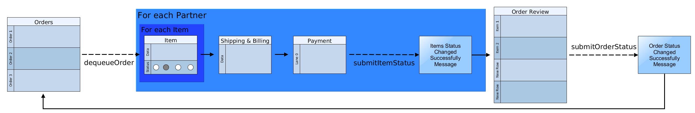

# Getting started

## Source 
Based on a Webpack example project with React, React Router and Flux (Alt): https://underthehood.myob.com/changing-of-the-guard-in-web-technologies/

## Requirements
Make sure you have installed NodeJS and NPM first and that you can run them from the command line.
* Run `npm install` first to install dependencies

## Commands
* `npm run build` - Build the project
* `npm run watch` - Start the Webpack dev server

## Documentation

### Components Flow Interaction

### UI Flow

### Order Wizard Flow

